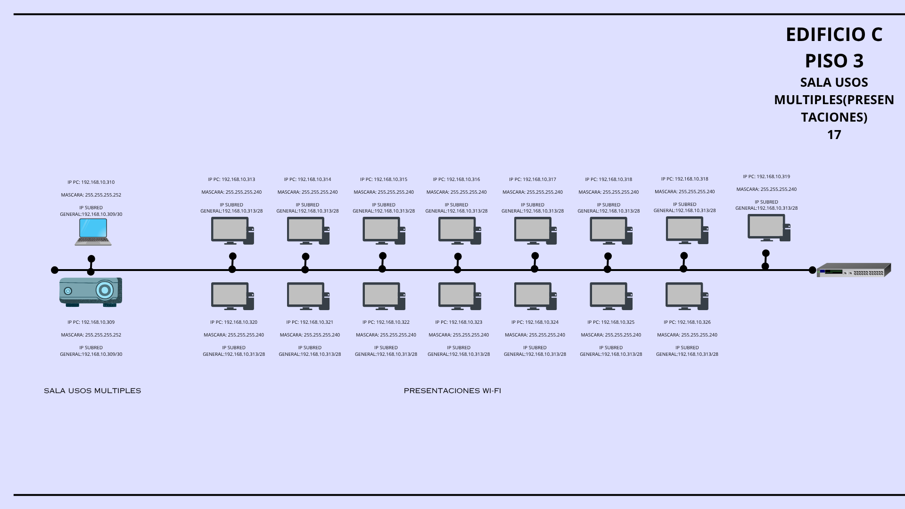
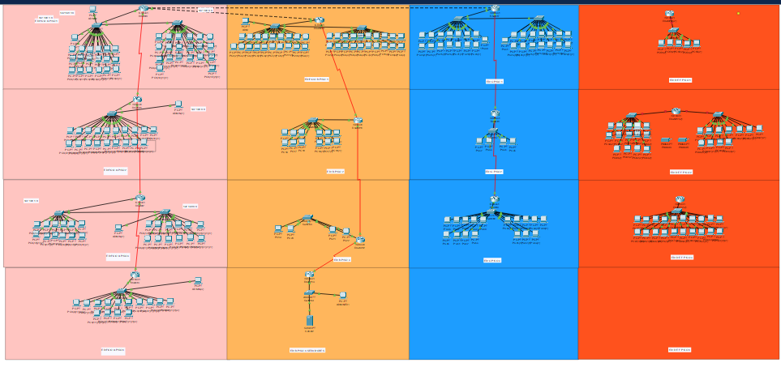
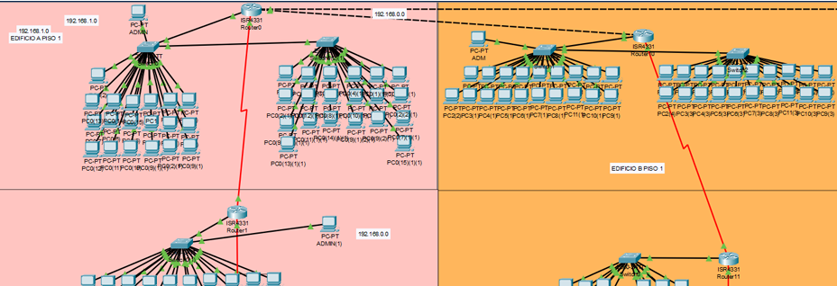
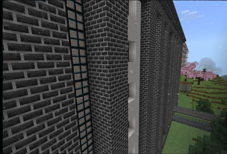

# 🏢 Simulación de Infraestructura Corporativa: Redes, Arquitectura y Presupuesto

**Proyecto de Ingeniería Integral: Diseño de Espacios, Planeación de Red y Factibilidad Económica.**

Este proyecto presenta una propuesta técnica y administrativa para la infraestructura tecnológica de un entorno corporativo. A diferencia de un diseño de red aislado, este trabajo destaca por un enfoque **360°**, integrando el **diseño arquitectónico de interiores**, la distribución física de nodos, el análisis de costos reales y un prototipo lógico en Cisco Packet Tracer.

---

## Vista Previa del Proyecto

_Distribución de oficinas y áreas de trabajo._

_Ubicación estratégica de nodos de red._

_Arquitectura lógica de la red diseñada en Cisco Packet Tracer._

_Conectividad entre edificios._

_Diseño arquitectónico exterior del corporativo._

_Gestión de costos, selección de hardware._

---

## 🛠️ Stack Tecnológico y Áreas de Dominio

- **Diseño y Arquitectura:** Planificación de interiores, exteriores y zonificación de oficinas.
- **Simulación de Red:** Cisco Packet Tracer (Diseño de topología jerárquica).
- **Protocolos Proyectados:** Esquema Dual Stack (IPv4/IPv6), VLANs y segmentación por departamentos.
- **Gestión Financiera:** Análisis de presupuestos, cotización de hardware y selección de proveedores.
- **Seguridad:** Diseño de políticas de seguridad física (SITE) y lógica (ACLs / Port Security).

---

## ✨ Componentes Destacados

### 🏗️ Diseño Espacial y Distribución Física

- **Planificación de Infraestructura:** Diseño detallado de la ubicación del SITE (cuarto de servidores), estaciones de trabajo y canalización.
- **Ergonomía de Red:** Distribución estratégica de nodos de voz y datos basada en el flujo operativo real de los edificios.

### 🌐 Arquitectura de Red (Fase de Prototipado)

- **Validación Conceptual:** Diseño lógico de una red segmentada por VLANs (Administración, TI, Ventas) para optimizar el tráfico.
- **Escalabilidad:** Estructura jerárquica diseñada para permitir el crecimiento de la red sin afectar la disponibilidad.

### 💰 Gestión de Presupuestos (Finanzas)

- **Análisis de Inversión:** Desglose detallado de costos en hardware activo (Routers, Switches) y pasivo (Cableado Cat 6, Racks).
- **Factibilidad:** Propuesta económica "llave en mano" que integra materiales, equipo y mano de obra para una implementación real.

---

## 📊 Estado del Proyecto

> **Nota técnica:** Este repositorio se enfoca primordialmente en la **planeación, diseño arquitectónico y factibilidad económica**. La configuración en Cisco Packet Tracer funciona como una validación de concepto (PoC), centrada en el diseño de la topología y el direccionamiento lógico.

---

## 📂 Estructura del Repositorio

- `Simulacion_Red.pkt`: Prototipo de la topología en Cisco Packet Tracer.
- `Proyecto-Infraeestructuras-Redes.pdf`: Documentación completa del proyecto, Planeacion general, Plan financiero, diseños interiores(nodos y arquitectura), diseños exteriores, y criterios de diseño.
- `/img`: Evidencias visuales de la topología y planos.

---

## 🛡️ Criterios de Seguridad Diseñados

1.  **Seguridad Física:** Zonificación restringida para el área de servidores (SITE) según planos.
2.  **Seguridad de Puerto:** Planeación de mitigación de accesos no autorizados mediante filtrado MAC.
3.  **Seguridad Perimetral:** Diseño de Listas de Control de Acceso (ACLs) para la protección de segmentos críticos.
